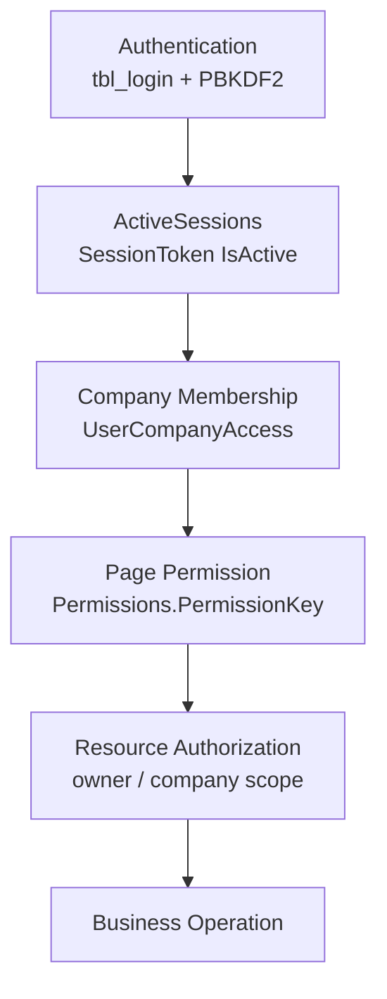

# Project_FLMX Security Baseline

**Status:** Canonical engineering contract  
**Applies from:** v2.1-security-foundation  
**Auth model:** `tbl_login` + `Session` + `dbo.ActiveSessions`. No ASP.NET Identity. No JWT.

This document is the security contract for every future feature, bug fix, and Cursor-generated change. It does not change runtime behavior.

Secret **values** are never recorded here. Do not paste connection strings, keys, passwords, or tokens into source, documentation, or pull-request text.

---

# 1. Purpose

**v2.1 Security Foundation** is the authoritative security contract for Project_FLMX (AminrupERP / Flame-ex).

All new pages, WebMethods, print pages, SQL, and tenant-scoped mutations must satisfy this baseline. Menu visibility is not authorization. Client-supplied identifiers are not trust.

Implementation history remains in:

| Document | Scope |
|----------|--------|
| `docs/14_Authentication_Authorization_Architecture.md` | Original as-is architecture review |
| `docs/15_Phase0B_Secrets_Deployment.md` | Credential / secrets hardening |
| `docs/16_Phase1A_SecurePage_RBAC.md` | SecurePage permission rollout |
| `docs/17_Phase1B_Role_Assignment.md` | RoleId ↔ UserRoles sync |
| `docs/18_Phase2A_Tenant_Membership.md` | UserCompanyAccess membership |
| `docs/19_Phase2B_Resource_Authorization.md` | Visit / expense resource scope |
| `docs/20_Phase2C_Remaining_Hardening.md` | Directory delete, quotation attach, approval replay |
| `docs/21_Phase3_Infrastructure_Hardening.md` | Kiosk isolation, secret inventory, machineKey |
| `docs/ADR-001` + `docs/29`–`docs/33` | Impersonation governance. Flag default false. No identity swap in PR-2A |

Those files explain how the foundation was built. This file defines what must remain true.

Ponytail rules that this contract restates:

- Parameterized SQL only.
- Tenant isolation via `Session["CompanyID"]` / `CompanyContext.CurrentCompanyID`.
- No public static user state in `.aspx.cs`.
- Fail closed. No invented fallbacks.

---

# 2. Security Request Lifecycle

Every protected ERP request must execute in this order. Later layers must not run if an earlier layer fails.

```
Authentication
    ↓
ActiveSessions
    ↓
Company Membership
    ↓
Page Permission
    ↓
Resource Authorization
    ↓
Business Operation
```



| Layer | Authoritative check | Fail closed |
|-------|---------------------|-------------|
| Authentication | `tbl_login` identity at login; session keys present on later requests | Redirect / 401 |
| ActiveSessions | `Session["SessionToken"]` matches an `IsActive = 1` row | Redirect / 401 |
| Company Membership | `UserCompanyAccess` for `Session["UserDbId"]` + `Session["CompanyID"]` | Missing company → 401. Unauthorized company → clear session company, 403 |
| Page Permission | `UserRoles` → `RolePermissions` → `Permissions.PermissionKey` | 403 |
| Resource Authorization | Resource belongs to current company and the required scope (view / edit / delete / approve) | Empty result, refuse mutation, or 403 |
| Business Operation | Existing workflow SQL and rules | Unchanged by this contract |

Do not invent company selection inside `EnsurePage`. Login does not set `CompanyID`. `SecurePage.OnInit` runs before `Bill.Master` `Page_Load`. Deep-linking to a `SecurePage` before any Master page has set `CompanyID` still 401s.

---

# 3. Authentication Contract

This section applies to the ERP login domain only: `index.aspx`, `tbl_login`, `dbo.ActiveSessions`.

The card kiosk (`index_card.aspx`, `tbl_card_login`, `admin/card.Master`) is **excluded**. It is a separate security domain. See §12.

## 3.1 Password verification

| Situation | Required result |
|-----------|-----------------|
| `PasswordHash` + `PasswordSalt` present | PBKDF2 only (`Rfc2898DeriveBytes`, 100000 iterations). Constant-time compare. Plaintext column is ignored. |
| Hash missing, leftover `Password` matches | One-time upgrade: write PBKDF2 hash, set `Password = NULL`, then continue the existing session path. |
| Hash missing and no matching plaintext | Fail closed. Token reset or admin reset only. |
| Hash present and verify fails | Fail closed. Plaintext is never tried. |

Do not add a plaintext fallback. Do not migrate to ASP.NET Identity or JWT.

## 3.2 Session requirements

After successful ERP login the session must carry:

| Key | Meaning |
|-----|---------|
| `Session["USERID"]` | Business key (`tbl_login.User_Id`) |
| `Session["UserDbId"]` | Numeric `tbl_login.Id` |
| `Session["SessionToken"]` | Guid stored in `dbo.ActiveSessions` |
| `Session["RoleId"]` / `Session["RoleName"]` | Cosmetic display only |

`Session["CompanyID"]` is **not** set at login.

A companion Forms cookie is issued so `/Uploads` anonymous deny works. Forms Authentication is not the identity system.

`USERID` alone is not an authenticated ERP session. `AuthGuard.TryValidateSession` requires `USERID`, `SessionToken`, and an active `ActiveSessions` row.

## 3.3 ActiveSessions

- New ERP login deactivates prior `ActiveSessions` rows for that numeric user `Id`, then inserts the new token.
- `Bill.Master` and `AuthGuard` re-read `IsActive` on protected requests.
- Logout deactivates the token and clears / abandons the session.
- Idle timeout is enforced via heartbeat (approximately 30 minutes idle).

Do not accept a session that has `USERID` but no valid `SessionToken`.

## 3.4 OTP

Login email OTP must be CSPRNG, stored in session, expiry-bounded (`LoginOtpExpiryMinutes`, default 10), and attempt-limited. OTP is not `machineKey` and not AES.

## 3.5 Password reset

- Issue a CSPRNG token. Store SHA-256 hex in `dbo.PasswordResetTokens` with UTC expiry and `UsedAtUtc`.
- Do not write a temporary password. Do not null `PasswordHash` on request.
- The stored hash changes only after `reset_password.aspx` verifies an unused, unexpired token.
- Lifetime is `PasswordResetTokenMinutes` (default 30).
- If the table is missing, fail closed with a generic unavailable message. No plaintext fallback.

Public authentication surfaces (`index.aspx`, `reset_password.aspx`) must remain reachable without a menu grant. Forced password / contact lockout pages (`settings.aspx`, `Update/password.aspx`) must remain reachable for an authenticated session without a `PermissionKey`.

---

# 4. Authorization Contract

Menu `<li>` visibility is cosmetic. Authorization is enforced on the server at the point of action.

## 4.1 Permission catalog

Grants are:

`UserRoles` → `RolePermissions` → `Permissions.PermissionKey`

`PermissionKey` values are the existing menu HTML `id`s on `Bill.Master`. Do not invent a parallel catalog. Filename / menu-id mismatches are documented in `docs/16_Phase1A_SecurePage_RBAC.md` and must be reused, not renamed silently.

`tbl_login.RoleId` is the display / primary role (login session + header). `UserRoles` is many-to-many and is what `HasPermission` reads. Phase 1B keeps those two models synchronized. Neither column is removed.

`ReportingManagerId` is not a permission and not an ACL.

## 4.2 SecurePage

Every new ERP product page that sits behind `Bill.Master` and a menu key must inherit `SecurePage`.

| Property | Contract |
|----------|----------|
| `RequiredPermissionKey` | Single menu `PermissionKey`. Checked in `OnInit` on every GET and postback. |
| `RequiredAnyPermissionKeys` | Dual-parent pages only (example: `expense_entry` uses `visit_planner` **or** `vw_dailyrpts`). Empty / null list fails closed. |
| `RequireCompanyContext` | Default `true`. Missing company → 401. Unauthorized company → 403. |

`OnInit` runs before button events. Postbacks cannot skip the check.

Do **not** convert:

- Public auth pages
- Forced settings / password pages
- `home.aspx` (Master sets `CompanyID` on this first GET)
- Card kiosk / `card.Master` pages
- Print pages (use `EnsurePrint`)

## 4.3 AuthGuard

`AuthGuard` is the only shared enforcement API. New gates must call it; they must not copy a weaker `USERID != null` check.

| API | When |
|-----|------|
| `TryValidateSession` | Session + ActiveSessions |
| `EnsurePage` / `EnsurePageAny` | Page `OnInit` (used by `SecurePage`) |
| `HasPermission` | Same join as the menu |
| `EnsureWebMethod` / `EnsureWebMethodPermission` | `[WebMethod]` (page `OnInit` does not run) |
| `EnsurePrint` | `print/*.aspx` (no Master, no menu key) |

## 4.4 WebMethod requirements

`[WebMethod]` skips `SecurePage.OnInit`. Every ERP WebMethod must:

1. Use `[WebMethod(EnableSession = true)]`.
2. Call `AuthGuard.EnsureWebMethodPermission(key)` with the **same** `PermissionKey` as the hosting page (or `EnsureWebMethod` only when the page has no key and that exception is already documented).
3. Then validate resource identifiers against current company / owner / manager-dashboard scope.

Throw 401 / 403. Do not return business data on auth failure.

## 4.5 Print-page requirements

Print pages have no Master and no menu key. Every print page must call `AuthGuard.EnsurePrint(page, mapKey, id)`:

1. Valid ERP session
2. Authorized current `CompanyID`
3. Mapped resource belongs to that company (`RecordInCompany`)
4. Unmapped print keys fail closed
5. Empty id is allowed only when the page has no record parameter

---

# 5. Tenant Contract

`Session["CompanyID"]` is the runtime tenant. `CompanyContext.CurrentCompanyID` reads that session value. Downstream queries must keep filtering on it.

`dbo.UserCompanyAccess` is the membership ACL. Presence in `tbl_Company` is not access.

## 5.1 Membership

| Rule | Contract |
|------|----------|
| Key | `(UserId, CompanyID)` where `UserId` is `tbl_login.Id` (`Session["UserDbId"]`) |
| Active | `UserCompanyAccess.IsActive = 1` and company `IsActive = 1 OR IsActive IS NULL` |
| Fallback | **None.** No all-company list. No first-dropdown-item default. |
| Initial company | 0 memberships → 0. 1 → that company. Many → `tbl_login.CompanyID` **only if it is already a membership**. Otherwise 0. |

`AuthGuard.UserCanAccessCompany` is a database EXISTS check. It does not trust dropdown, ViewState, query string, or posted values.

## 5.2 Company switch

The header switcher binds `AuthGuard.GetAuthorizedCompanies()` only.

On `SelectedIndexChanged`: parse int → `UserCanAccessCompany` → then write `Session["CompanyID"]`. Reject otherwise.

## 5.3 Membership revalidation

On every `EnsurePage` / `EnsureWebMethod` / `EnsurePrint` path that requires company:

- Missing `CompanyID` → **401**
- `CompanyID` set but not an active membership → `ClearUnauthorizedCompanySession`, **403**

AddUser may insert home-tenant membership (`TryEnsureHomeMembership`) for the same company already written to `tbl_login.CompanyID`. It must not grant every company.

## 5.4 Client input

**`CompanyID` must never be trusted from client input.**

Do not read tenant from query string, form post, hidden field, cookie, or ViewState as the authorization tenant. The session value is used only after membership revalidation. SQL must still parameterize `@CompanyID` from that validated session context.

---

# 6. Resource Authorization Contract

Page permission is not enough to mutate a row addressed by an identifier.

Every mutation must satisfy **all four**:

1. **Authenticated** — `TryValidateSession` (ERP session + ActiveSessions)
2. **Current company** — `UserCompanyAccess` for `Session["CompanyID"]`
3. **Permission** — the page / WebMethod `PermissionKey`
4. **Resource scope** — the identifier belongs to the current company **and** the operation’s scope below

Lookup failure returns false / empty / refuse. No “all rows” fallback.

## 6.1 Operation types

| Operation | Meaning | Typical predicate |
|-----------|---------|-------------------|
| **View** | Read a record the user is allowed to see | Owner (`CreatedByCode = Session["USERID"]` + company) **or** manager-dashboard (`srch_dailyrpts` + company visit). Use `UserCanViewVisit` for visits. |
| **Edit** | Change an owner-owned record | Owner only (`UserCanEditOwnVisit` / `UserOwnsVisit`). VIEW is not EDIT. |
| **Delete** | Remove a directory or owned row | Current company + delete `PermissionKey` + resource in company (example: `ClientInCurrentCompany` / `VendorInCurrentCompany`). Client/vendor delete is **not** owner-based. |
| **Approve** | Workflow status change | Manager-dashboard or admin-approval key + resource in current company + pending (or documented pending-or-null) status. Not owner keys. Not `ReportingManagerId`. |

Do not treat `srch_dailyrpts` view as owner edit (`visit_planner` / `vw_dailyrpts`). Approve uses the manager-dashboard or admin-approval key.

## 6.2 Identifier handling

- Parse IDs server-side (`TryParsePositiveInt` or equivalent). Reject missing / non-positive / non-integer ids.
- Re-check hidden fields and query-string ids on POST / INSERT / UPDATE / DELETE. Binding a value to the UI is not authorization.
- Parameterize SQL. Resource id and `CompanyID` are always parameters.
- Refuse IDOR: a valid session in company A must not read or mutate company B’s row by guessing `Id`.

## 6.3 Existing primitives (reuse, do not fork)

| Helper | Scope |
|--------|--------|
| `VisitBelongsToCurrentCompany` | Visit `Id` + current `CompanyID` |
| `UserOwnsVisit` | Same plus `CreatedByCode` |
| `UserCanViewVisit` | Owner **or** (`srch_dailyrpts` and company visit) |
| `UserCanEditOwnVisit` | Owner only |
| `UserCanManageCompanyVisits` | `srch_dailyrpts` after session + membership |
| `UserCanApproveVisit` | Manage key + company visit. **Not** reporting-line |
| `UserCanApproveExpense` | Manage key + expense linked to that visit in current company |
| `ClientInCurrentCompany` / `VendorInCurrentCompany` | Directory id + current company |
| `UserCanApprovePendingLeave` / `UserCanApprovePendingRegularization` | Admin approval key + pending + current company |

New resource types must add an equivalent company-scoped helper on `AuthGuard`, not a one-off concatenated `WHERE Id = ...`.

---

# 7. Protected Components

These types are protected architecture. Behavior changes require architectural review. Do not “simplify,” inline, or bypass them in feature work.

| Component | Status |
|-----------|--------|
| AuthGuard | Protected |
| SecurePage | Protected |
| UserRoleAssignment | Protected |
| UserCompanyAccess | Protected |

Also treat as frozen unless a dedicated security change is approved:

- `tbl_login` PBKDF2 verify / upgrade path
- `dbo.ActiveSessions` token lifecycle
- `PasswordResetTokens` one-time SHA-256 reset
- Dual role model (`tbl_login.RoleId` display + `UserRoles` grants)
- Company switcher membership binding
- Print `TenantSql` maps

A Cursor-generated change that weakens any of the above is a defect, not a refactor.

---

# 8. New Page Checklist

Every new `SecurePage` must satisfy:

- `RequiredPermissionKey` (or documented `RequiredAnyPermissionKeys`)
- Session validation
- Company validation
- Resource validation

Use this checklist before merge:

- [ ] Page inherits `SecurePage` (unless it is a documented exception in §4.2)
- [ ] `RequiredPermissionKey` matches an existing `Permissions.PermissionKey` / menu id
- [ ] Dual-parent pages use `RequiredAnyPermissionKeys`; empty array is not used
- [ ] `RequireCompanyContext` is true unless a documented exception applies
- [ ] `OnInit` is not skipped or replaced with a `USERID`-only check
- [ ] Query string / hidden ids are re-validated with AuthGuard resource helpers
- [ ] All SQL is parameterized and includes `@CompanyID` (or the documented ownership predicate)
- [ ] No static user fields in the code-behind
- [ ] Kiosk / `card.Master` pages are not forced onto `SecurePage`

---

# 9. New WebMethod Checklist

Every WebMethod must:

- EnableSession
- EnsureWebMethodPermission
- Validate resource IDs
- Parameterize SQL

Use this checklist before merge:

- [ ] `[WebMethod(EnableSession = true)]`
- [ ] First line of the method: `AuthGuard.EnsureWebMethodPermission(sameKeyAsPage)`
- [ ] 401 if session or company is missing; 403 if membership or permission fails
- [ ] Resource ids parsed and checked (`UserOwnsVisit`, `UserCanViewVisit`, `ClientInCurrentCompany`, or a new AuthGuard helper)
- [ ] Hidden / posted ids re-checked on mutation, not trusted from the client
- [ ] SQL parameterized; `@CompanyID` from validated session context
- [ ] No business payload returned after auth failure

---

# 10. New Print Page Checklist

Every print page must:

- EnsurePrint
- Validate mapped resource
- Validate CompanyID

Use this checklist before merge:

- [ ] `AuthGuard.EnsurePrint(this, mapKey, id)` runs before binding data
- [ ] `mapKey` exists in the print tenant map; unmapped keys fail closed
- [ ] Record id, when present, is checked with `RecordInCompany` against current `CompanyID`
- [ ] Company comes from validated session, never from the query string as trust
- [ ] SQL parameterized
- [ ] Print page does not inherit `SecurePage` (no Master / no menu key by design)

---

# 11. Security Review Checklist

Mandatory for every PR that touches pages, WebMethods, print, SQL, session, or configuration:

- [ ] Session validated (`USERID` + `SessionToken` + `ActiveSessions.IsActive`)
- [ ] Company validated (`UserCompanyAccess` for `Session["CompanyID"]`)
- [ ] Permission enforced at the point of action (`SecurePage` / `EnsureWebMethodPermission` / `EnsurePrint`)
- [ ] Resource scoped (view / edit / delete / approve as in §6)
- [ ] SQL parameterized (no string concatenation of ids or tenant)
- [ ] No client-trusted `CompanyID`
- [ ] No IDOR (guessed `Id` cannot cross company or owner scope)
- [ ] No secret exposure (no new credentials in source, docs, or PR text)
- [ ] Protected components (§7) unchanged unless the PR is an approved architecture change
- [ ] Kiosk code not merged into ERP `AuthGuard` / `ActiveSessions`
- [ ] `machineKey` / `UrlTokenAesKey` not rotated as a drive-by change
- [ ] Fail closed: missing table, missing membership, missing map, bad parse → deny

---

# 12. Known Architectural Boundaries

Documented constraints. Do not “solve” them in ordinary feature work.

| Boundary | Contract |
|----------|----------|
| **Decision #8** | `ReportingManagerId` is email / display only. Manager visit approve and leave / attendance approve are company-wide for the page permission. Do not add reporting-line ACL without a product decision. |
| **Decision #9** | No HQ cross-company role. Membership in `UserCompanyAccess` is the only way to hold another `CompanyID`. Do not invent an all-tenant exception. |
| **Kiosk subsystem** | `index_card.aspx` / `tbl_card_login` / `admin/card.Master` is a separate plaintext domain. Parameterized login SQL only. No `AuthGuard`, no `ActiveSessions`, no `UserRoles`, no `UserCompanyAccess`. Do not merge into ERP auth. Remaining concatenated kiosk profile SQL is isolated debt. |
| **machineKey governance** | ViewState and Forms-cookie MAC. Do not rotate without a scheduled full-farm IIS recycle. Changing keys invalidates postbacks and the `/Uploads` companion cookie. Rotation is an ops procedure (`docs/21` §3). |
| **Secret rotation (ops)** | Runtime is configuration-first (`ConfigurationManager` / `AppSecrets`). Do not strip live values from `Web.config` until server-level config is in place. Do not rotate `DbConn`, SMTP, iTop, Msg91, or `UrlTokenAesKey` in a feature PR. Empty `UrlTokenAesKey` keeps the compiled AES fallback so existing QuickAction links decrypt. Wrong-length key fails closed. Visit chat/approval mail uses `CommunicationGateway` (D-11 hardcoded SMTP in those two files is **stale**). Remaining direct `SmtpClient` pages: [`docs/11_Communications.md`](11_Communications.md). |

Other documented stops that remain out of ordinary feature scope:

- `home.aspx` is not a `SecurePage` (company is set on first Master GET).
- `Create_quotation` page RBAC is still session + Master; visit **attach** uses `UserCanViewVisit`.
- Invoice / PO / stock / scheduler concatenated SQL is historical debt; new code in those modules must still follow this baseline.

---

# 13. Version Declaration

> This document defines the Project_FLMX Security Baseline beginning with v2.1-security-foundation.
