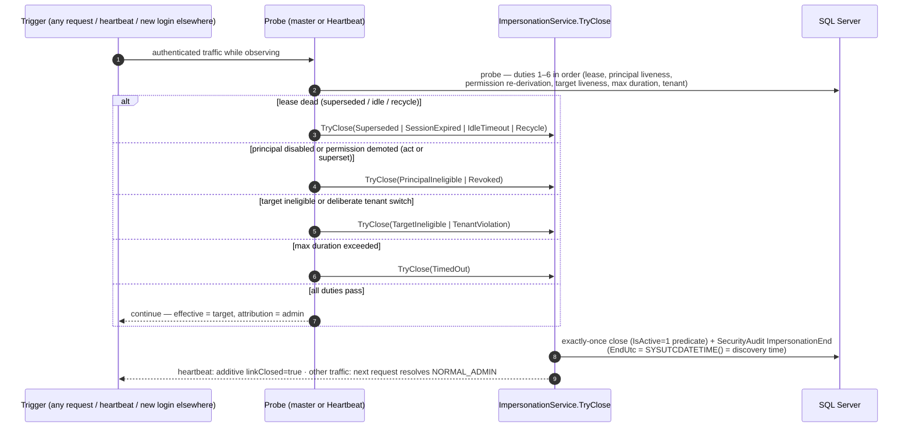

# 33 — Implementation-Readiness Review: Identity/Session Model for PR-1

| | |
|---|---|
| **Status** | **Implementation-readiness gate — validates the session and identity architecture before PR-1** |
| **Author role** | Principal Identity Architect |
| **Reads first** | [`32_Impersonation_Final_Architecture_Review.md`](32_Impersonation_Final_Architecture_Review.md) — its **"Go with changes"** verdict is accepted; this document does not redesign, it resolves the items Doc 32 left open (HR-1, HR-6, HR-3, P-4) and pins the literals PR-1 must ship |
| **Scope** | Dual identity model · state transitions · lease behavior · authorization refresh · edge cases · PR-1 checklist |
| **Constraint** | Architecture documentation only — no C#, no SQL |

---

## Executive Verdict — **READY FOR PR-1**

PR-1 (neutralize legacy `SwitchUser` + inert DDL foundation, per [31](31_Impersonation_Implementation_Roadmap.md)) is not blocked by any unresolved identity/session question. The three Doc 32 open items resolve as follows, with the amendment text finalized in §8 of this document:

| Doc 32 item | Resolution | Blocks |
|---|---|---|
| **HR-6** (mid-link permission revocation) | Pinned as **INV-13**: the per-request probe re-derives the principal's effective permission set; loss of `SwitchUser` **or** of any permission the target holds ⇒ immediate forced close (`Revoked`). Doc 25 §3-F5 Option B and §4-E4 "observation continues" language are **withdrawn**. | PR-2 (fork must implement it) |
| **HR-1** (120 s forced-rollback claim) | Amended honestly: the ≤120 s window holds **only with a live browser tab** (heartbeat-driven). Any other failure mode closes **lazily** — the link is lease-inert immediately, but the audit closure timestamp is the *discovery* time. **INV-14** pins the timestamp semantics so audit reconstruction stays correct in all modes. | PR-2/PR-3 wording + security notice |
| **HR-3** (test harness) | **Explicit decision: minimal unit-test project in PR-2** for the pure predicates (superset rule, eligibility, intent-token consumption); transition/failure matrix stays a documented manual UAT script on `flamex_uat` (doc 29 §8) until the harness exists. Rationale: zero test infrastructure today (verified: no test project in the solution); standing one up is PR-2 work, not PR-1 work. | PR-2 merge only |
| **EndReason vocabulary drift** (Doc 32 introduced `PrincipalIneligible`; Doc 25's set lacks it; Doc 31 maps tenant-switch closes to the T8 path) | Pinned **canonical set of 11 reasons** (§7) — PR-1's DDL header carries it, so no later ALTER or analytics fork. | **PR-1 (must ship with the foundation script)** |

**Why PR-1 is ready now:** it is build-repair + inert, additive schema + evidence gates. Nothing it ships depends on HR-6/HR-1 implementation or the test harness — those gate PR-2/PR-3. The only readiness delta PR-1 itself must absorb is the EndReason vocabulary pin (above) and one checklist line.

**Verification caveat (honest scope):** this review workspace contains the documentation corpus only — the C# source tree is not present in the snapshot, so compile-state of `SwitchUser.aspx.cs` cannot be re-verified here. That fact rests on Doc 29 G3 / Doc 32 HR-2 (verified in-repo at review time; `Output-Build.txt` is a developer-machine artifact not in git). This is precisely why Doc 31's **clean-checkout compile log is a merge-blocking gate** — it re-proves the build at merge time regardless of this caveat.

**Prerequisite ledger for PR-1:** P-1 is PR-1 itself. P-2 (`UserCompanyAccess` DDL), P-3 (harness decision — recorded here), P-4 (doc amendments — text finalized here, ships as a parallel docs-only PR), P-5–P-7 gate PR-2/PR-3/production, **not** PR-1 merge.

---

## Session Object Model (with ownership)

### Ownership model (normative)

| Asset | Owned by | Never owned by |
|---|---|---|
| ASP.NET Session object (L1) + `ActiveSessions` row (L6) | The **administrator principal**, for the life of the login | The link, the target, the UI |
| `ImpersonationLink` row (L4) | The **service contract** (sole writer) | Pages, master, heartbeat, any out-of-process component |
| `Session["ImpersonationToken"]` (L2) | The admin's session — a **GUID pointer**, nothing more | — |
| `SecurityAudit` rows (L5) | The append-only ledger; nobody edits | — |
| Banner / company dropdown state | UI **projection** of L2+L4, rebuilt per request | State authority |

Impersonation is a **lease held by the admin's session token** on a link row — never an identity transfer. The session belongs to the admin before, during, and after observation.

### Layers (Doc 25 §1.1 restated with readiness deltas)

| Layer | Object | Written by | Read by | Delta from Doc 25 |
|---|---|---|---|---|
| L1 | Principal keys (`USERID`, `UserDbId`, `SessionToken`, `RoleId`, `RoleName`, `CompanyID`, …) | Login path only | Everything (read-only) | None — INV-1 stands |
| L2 | `Session["ImpersonationToken"]` | `TryStart` / `TryEnd` / `TryClose` | Probe | None |
| L3 | `SecurityContext` (per-request, `HttpContext.Items`) | Rebuilt every request | Pages, handlers, print gate | **Carries the probe verdict + effective identity; never cached beyond the request** |
| L4 | `ImpersonationLink` row | Service contract only | Probe | **EndReason set extended to 11 (§7); scheduled-sweeper mode withdrawn (INV-16)** |
| L5 | `SecurityAudit` rows | Service contract only | Reports (Q-series) | None |
| L6 | `ActiveSessions` row (existing) | Login / logout / heartbeat (existing) | Lease check | None |

### Probe duties (the single per-request query while observing; zero cost otherwise)

The Doc 29 §2 probe is pinned to validate, in one parameterized roundtrip, **in this order**:

1. **Lease** — link `IsActive=1` AND `AdminSessionToken = L1.SessionToken` AND L6 row active (dead lease ⇒ close `Superseded`/`SessionExpired`/`IdleTimeout`/`Recycle` per cause).
2. **Principal liveness** — admin `tbl_login` row still active (disabled/deleted mid-link ⇒ close `PrincipalIneligible`). *New duty — closes the "admin disabled mid-link" gap (§5 row 4).*
3. **Principal permission re-derivation (INV-13)** — principal's effective permission set re-computed per request; missing `SwitchUser` or any target-held permission ⇒ close `Revoked`.
4. **Target liveness + eligibility** — target active, no active password-reset, target `UserCompanyAccess` for `CompanyID` intact (⇒ close `TargetIneligible`).
5. **Max duration** — 4 h absolute cap (⇒ close `TimedOut`).
6. **Tenant consistency** — link `CompanyID` vs principal membership; membership checks stay principal-scoped (existing master R3 behavior; INV-9). A deliberate company-switch attempt mid-link ⇒ close `TenantViolation` (§7).

**SQL failure at any step ⇒ fail closed to `NORMAL_ADMIN`** (Doc 25 F13): a lookup error means *no link*, never *link granted*.

### Dual identity summary

| Question | Answer |
|---|---|
| Who is the original administrator? | L1 keys, written once at login, read-only forever (INV-1) |
| Who is the effective user? | Resolved per request from L4 into L3 (`SecurityContext`); never stored in L1 |
| Who is attributed for writes? | Always the **admin** (`ResolveActor()`); the target is observed, never acts |
| Who owns the session? | The admin. The target receives no session, no cookie, no row (INV-3) |
| Who pays the per-request cost? | Only impersonating sessions (rare, internal ERP) |

---

## Identity Invariants (must never be violated)

Restated from Doc 24 (normative, unchanged): **INV-1** principal keys immutable during a link · **INV-2** effective identity resolved per request from the link · **INV-3** target receives no session/token/row · **INV-4** authorization deviation only inside the `HasPermission` fork; auth + membership legs stay principal-scoped · **INV-6** every transition audited in the same transaction; audit failure aborts the transition · **INV-7** rollback = ending the link; no snapshot restore exists · **INV-8** target's account/sessions/work untouched · **INV-9** membership principal-scoped; link fixes the tenant, never broadens it · **INV-10** kiosk realm disjoint · **INV-12** session holds a pointer only — no identity/roles in session or cookies.

Pinned by this review (new numbers; Doc 24 defines INV-1…INV-12, so 13+ are free):

| # | Invariant |
|---|---|
| **INV-13** | Every probe re-derives the principal's effective permission set. Loss of `SwitchUser`, or of any permission the target holds, ⇒ immediate forced close (`Revoked`). No stale-granted window exists. *(HR-6 elimination; supersedes Doc 25 F5-Option-B and §4-E4.)* |
| **INV-14** | `EndUtc` is the **closure/discovery** timestamp; the **proven activity window is `[StartedUtc, LastUsedUtc]`**. All attribution and reconstruction queries join on the proven window — never on `EndUtc`. |
| **INV-15** | Exactly one live link per principal and one per target, enforced inside the `TryStart` transaction by DB predicates — never by UI logic. |
| **INV-16** | Only the application's service contract writes `ImpersonationLink`/`SecurityAudit`. v1 closure is probe/heartbeat/lazy only; Doc 25 §5.3's scheduled SQL-Agent sweeper is **withdrawn** until re-reviewed as its own proposal (Doc 32 §5). |
| **INV-17** | All identity joins key on numeric `Id`; `User_Id` is non-unique (HR-5) and must not appear in any join in this feature. |

---

## State Diagram

```mermaid
stateDiagram-v2
    [*] --> LoggedOut

    LoggedOut --> NormalAdmin : T1 login\n(principal written once, ActiveSessions minted)

    NormalAdmin --> NormalAdmin : T10 TryStart denied\n(audit ImpersonationDenied)
    NormalAdmin --> LinkActive : T2 TryStart accepted\n(link + audit, one transaction; L2 pointer set)

    LinkActive --> NormalAdmin : T3 End Observation (UserEnded)
    LinkActive --> LinkClosed : T4 logout / T5 superseded\nT6 expired / T7 recycle\nT8 target ineligible / T9 timed out
    LinkActive --> LinkClosed : T12 probe-forced\n(Revoked | PrincipalIneligible | TenantViolation)

    LinkClosed --> NormalAdmin : next request resolves NORMAL_ADMIN
    NormalAdmin --> LoggedOut : T11 logout
    LinkActive --> LoggedOut : T11 logout\n(link closed FIRST, EndReason=Logout)

    LinkClosed --> [*]
```



Transition table additions to Doc 25 §2.2: **T12 — `LinkActive → LinkClosed`**, trigger: probe duty 2/3/6 fails; actions: `TryClose` with mapped reason (exactly-once predicate) + audit; distinct from T8 (target-side) and T10 (denial — no state change).

---

## Sequence Diagrams

### Start

```mermaid
sequenceDiagram
    autonumber
    participant A as Admin browser
    participant M as Bill.Master (per request)
    participant I as ImpersonationService
    participant DB as SQL Server

    A->>M: GET SwitchUser.aspx (search → select → reason → confirm)
    M->>M: TryValidateSession (unchanged, principal-scoped)
    Note over M: probe: no L2 pointer ⇒ early return, zero new SQL
    A->>M: POST confirm (target, reason, intent token)
    M->>I: TryStart(principal, target, reason, intent)
    I->>DB: transaction — 9 fail-closed gates: act perm (principal),<br/>eligibility, superset (pure fn), one-per-principal,<br/>one-per-target, intent unused
    alt all gates pass
        I->>DB: INSERT ImpersonationLink (IsActive=1) + SecurityAudit ImpersonationStart (same tx)
        I-->>M: LinkToken
        M->>M: Session["ImpersonationToken"] = LinkToken (server-side, before response)
        M-->>A: redirect home — banner active; effective = target; attribution = admin
    else any gate fails
        I->>DB: SecurityAudit ImpersonationDenied(cause) (committed)
        I-->>A: denial UI — state unchanged (NORMAL_ADMIN)
    end
```

### Rollback (voluntary End Observation)

```mermaid
sequenceDiagram
    autonumber
    participant A as Admin browser
    participant M as Bill.Master
    participant I as ImpersonationService
    participant DB as SQL Server

    A->>M: POST End Observation
    M->>I: TryEnd(principal, LinkToken)
    I->>DB: tx: UPDATE link SET IsActive=0, EndUtc=SYSUTCDATETIME(), EndReason='UserEnded'<br/>WHERE LinkToken=@t AND IsActive=1 AND AdminSessionToken=@st
    alt row closed (1 row affected)
        I->>DB: SecurityAudit ImpersonationEnd (same transaction)
        M->>M: clear L2; re-derive admin authorization fresh (INV-7 — no restore)
        M-->>A: 302 home — NORMAL_ADMIN
    else 0 rows (already closed)
        Note over I: idempotent no-op — read stored EndReason
        M->>M: clear L2
        M-->>A: NORMAL_ADMIN (banner gone)
    end
```

### Forced close (all triggers converge on one exactly-once path)



---

## Edge-Case Decision Matrix

| # | Edge case | Decision | Invariant / audit |
|---|---|---|---|
| 1 | Multiple tabs, same browser | One session, one link; banner is a projection — stale banner self-corrects on next server interaction | INV-2; no extra audit rows |
| 2 | Concurrent browsers, same admin | Second login supersedes first (G4); first browser heartbeat `superseded` → forced logout; link closes `Superseded` | INV-15; `ImpersonationEnd(Superseded)` |
| 3 | Session expiry (20-min InProc / 30-min idle) | Link lease-dead immediately; lazy close for audit completeness; detection lag recorded, never hidden | INV-14 |
| 4 | **Admin disabled mid-link** | Probe duty 2 closes on next request/heartbeat ⇒ `PrincipalIneligible` | INV-13 family; new EndReason |
| 5 | **Target disabled mid-link** | Probe duty 4 (join, no sweeper latency) ⇒ `TargetIneligible` | T8/F4 |
| 6 | Permission revoked mid-link (role removed from user **or** permission removed from role — both captured by set re-derivation) | Probe duty 3 ⇒ `Revoked`; fail-closed, no stale-granted window | **INV-13** |
| 7 | Superset broken mid-link | Same as 6 — Doc 25 E4 "continue" withdrawn | **INV-13** |
| 8 | Deliberate company switch attempt mid-link (direct postback, not the disabled dropdown) | Switch refused **and** link closed ⇒ `TenantViolation` (mechanism: T8 lazy-close path, distinct literal for analytics) | INV-9 |
| 9 | Browser refresh | Re-resolve per request; banner reappears; no client state involved | G6 |
| 10 | App-pool recycle | L1/L2 gone; link lease-dead; sweeper closes `Recycle`; admin re-logs in | F1; INV-12 |
| 11 | Double-submit on confirm | Intent token consumed exactly once; second ⇒ `ImpersonationDenied(intent_used)` | INV-15; denial audit |
| 12 | Two admins, same target | Second TryStart denied `target_in_use` | INV-15; denial audit |
| 13 | DB failure during probe | Fail closed to `NORMAL_ADMIN` — degraded availability, intact security | F13 |
| 14 | Audit write fails at TryEnd | Admin retries; commit is idempotent (row-closed check); lease-dead regardless | INV-6; F8 |
| 15 | Long postback crossing link end | In-flight request completes under its already-resolved L3; next request is clean (L3 is request-scoped) | INV-2; E5 |

---

## Lease, Heartbeat, Lazy Sweep — Exact Semantics

| Mechanism | Behavior | Enforcement window |
|---|---|---|
| **Heartbeat** (client poll, live tab) | Principal liveness (unchanged, G3) + from PR-3, additive `linkClosed` after probe duties | ≤ one heartbeat interval for all forced closes **while a tab is open** |
| **Per-request probe** | Duties 1–6 on every request that presents L2 | Immediate for any request made |
| **Lazy sweep** | Probabilistic close (1-in-20 requests) of lease-dead rows; grace = session timeout + one heartbeat interval (~50 min) | Audit completeness only — **security never depends on it** (the lease already made the row inert) |
| **Scheduled SQL-Agent sweeper** | **Withdrawn for v1** (INV-16, Doc 32 §5: no out-of-process writers) | — |

**End timestamp semantics (INV-14):**

| Closure mode | `EndUtc` means | Attribution window |
|---|---|---|
| Voluntary (T3/T4) | Actual end (same request) | `[StartedUtc, EndUtc]` |
| Heartbeat-forced (live tab) | Discovery ≈ actual (≤ 1 interval) | `[StartedUtc, LastUsedUtc]` |
| Lazy (no traffic) | When the lie was discovered | `[StartedUtc, LastUsedUtc]` — `EndUtc − LastUsedUtc` = detection lag, reported separately |

---

## EndReason Vocabulary (canonical — ships in PR-1's DDL header)

`UserEnded` · `Logout` · `Superseded` · `SessionExpired` · `IdleTimeout` · `Recycle` · `Revoked` · `TimedOut` · `TargetIneligible` · **`PrincipalIneligible`** (new — principal disabled/deleted mid-link; Doc 32's term) · **`TenantViolation`** (new — deliberate mid-link company switch).

Denials are **not** EndReasons: `ImpersonationDenied(cause)` stays a separate event per Doc 30.

---

## PR-1 Implementation Checklist

**Scope additions pinned by this review (beyond Doc 31's PR-1):**

1. The foundation script's header carries the **canonical EndReason set (11)** and the INV-14 timestamp-semantics note — pinning now avoids a later ALTER and analytics drift.
2. One checklist line: **identity joins key on numeric `Id` only** (INV-17) — goes into the feature PR template.

**Merge-blocking checklist:**

- [ ] **Clean-checkout compile log, before/after** attached (HR-2 evidence — this PR *is* the build repair)
- [ ] Legacy `SwitchUser.aspx.cs`: single-arg `HasPermission` call restored; `btnSwitch_Click`/`btnSwitchBack_Click` write paths removed; all `Original*` snapshot keys gone; fail-closed denial labels; shell + search grid retained for PR-3
- [ ] UAT evidence: page reachable by a temporarily-granted test account shows denial; **zero `ActiveSessions` INSERT** (Profiler/Extended Events output attached)
- [ ] **Zero new runtime SQL** anywhere in the PR (no page or handler reads/writes the new objects)
- [ ] `db/impersonation_foundation.sql`: both tables + indexes/FKs + `DENY UPDATE, DELETE` on `SecurityAudit` to the app login + seed (`SwitchUser` ensured, **zero role grants**; `ImpersonationAudit` inserted) + EndReason/INV-14 header pins; `IF NOT EXISTS` idempotent; reviewed-rollback section; house style per `db/pservice_snapshot.sql`
- [ ] **Evidence gate**: zero-grant catalog query output from **both** `flamex_uat` and `flamex_live` attached (revoke before merge if any grant found)
- [ ] `UserCompanyAccess` DDL presence check executed and recorded (gate for **PR-3 activation**; not blocking PR-1 merge)
- [ ] `docs/22_Security_Baseline.md` + `docs/SOLUTION_INDEX.md` impersonation note (read/write invariant; "identity swap is a defect")
- [ ] Four gates (**Security / Data / Regression / Scope**) with outputs attached; PR description cites docs 23–33
- [ ] Script executed on `flamex_uat` only; **not** on `flamex_live` until review sign-off

**Explicitly NOT required for PR-1 merge** (tracked, not blocking): test project in the `.sln` (PR-2, decision recorded in §Verdict), Doc 25/29/30 amendment PR (P-4 — text ready below, may merge in parallel with PR-1, must precede PR-2).

---

## Amendments Ready to Apply (P-4 docs-only PR)

| Doc | Amendment |
|---|---|
| Doc 29 §2 | Add probe duties 2 (principal liveness) and 3 (INV-13 permission re-derivation) to the covering query; add `PrincipalIneligible`/`TenantViolation` to the forced-close reason mapping |
| Doc 25 §2.2 | Add transition T12 (probe-forced closures); add the two new EndReasons to the LINK_CLOSED set |
| Doc 25 §3 F5 | Strike Option B; Option A (per-probe re-check ⇒ close `Revoked`) is normative (INV-13) |
| Doc 25 §4 E4 | Replace "observation continues" with "superset breakage forces closure (INV-13)" |
| Doc 25 §5.3 | Withdraw scheduled SQL-Agent mode for v1 (INV-16); lazy + probe only |
| Doc 30 §event catalog | Add `PrincipalIneligible`, `TenantViolation` event rows; pin window-join on the proven window (INV-14) in the Q-series notes |

---

## PR-1 → PR-2 Gate Summary

| Gate | Owner | Status |
|---|---|---|
| Identity/session model ready | This review | **Closed — Ready for PR-1** |
| EndReason vocabulary pinned | PR-1 DDL header | **Open — ship with PR-1** |
| HR-6 invariant in Doc 29 (INV-13) | P-4 docs PR | Text ready; merge before PR-2 |
| HR-1 honest window in Docs 25/30 + security notice | P-4 docs PR | Text ready; merge before PR-2 |
| Test harness decision | Recorded here: minimal test project in PR-2 | Open at PR-2 |
| `UserCompanyAccess` DDL on UAT | DBA / PR-3 activation | Open, hard gate for activation |

---

*End of document. Architecture documentation only — no production C# or SQL was written or modified. Series: [23](23_Impersonation_Architecture_Review.md)–[32](32_Impersonation_Final_Architecture_Review.md) precede; [31](31_Impersonation_Implementation_Roadmap.md) remains the execution path.*
