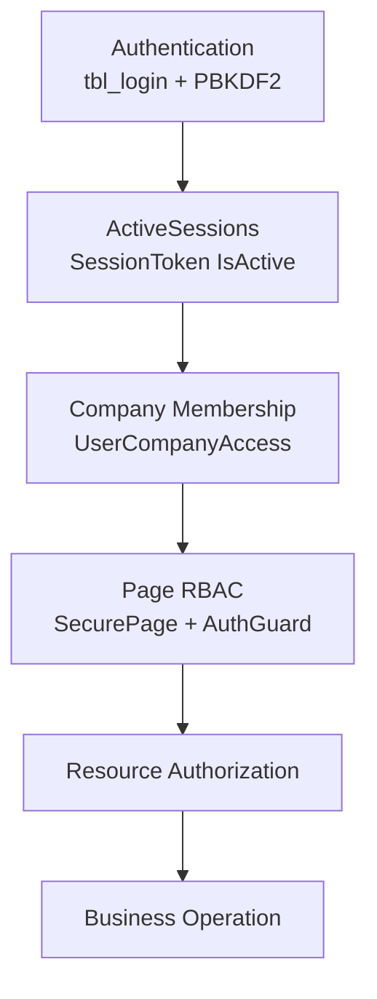

# FLMX v2.1 Security Foundation — Milestone Closure

**Program status:** Complete  
**Release tag:** `v2.1-security-foundation`  
**Promotion commit:** `62fd029c5fb57c2690171b4210662a2b4e1babf9`  
**Canonical contract:** [`docs/22_Security_Baseline.md`](22_Security_Baseline.md)

This file is the program closeout record. It is not a substitute for the Security Baseline. Future work follows `docs/22_Security_Baseline.md`.

---

## Executive Summary

Project_FLMX (AminrupERP / Flame-ex) completed an Authentication and Authorization modernization on ASP.NET Web Forms .NET Framework 4.x without migrating to ASP.NET Identity or JWT.

The program started as a read-only architecture review (`docs/14`) of custom `tbl_login` + `Session` identity, menu-only RBAC, an unscoped company switcher, ungated print/WebMethod surfaces, and credential gaps. Implementation followed a stacked sequence (PR #66–#74), then a merge-commit promotion of the `July_to_Sept26_DevNSupport` line into `master`. The review history was preserved: `master`’s prior snapshot remains the first parent of `62fd029`; the reviewed July implementation is the shipped tree.

**Shipped platform**

| Item | Value |
|------|--------|
| Promotion commit | `62fd029c5fb57c2690171b4210662a2b4e1babf9` |
| Previous `master` | `7c61ebfac705c2a74f6d8c0c2af17578143c957b` |
| July integration head (pre-promotion) | `5f81d38fd2725c76b36dde940d6de3980bc6dcf8` |
| Release tag | `v2.1-security-foundation` → `62fd029` |
| Canonical Security Baseline | `docs/22_Security_Baseline.md` |
| Governance closeout | PR #75 (v2.1.1 repository guardrails) |

The ERP now enforces server-side security as reusable infrastructure (`AuthGuard`, `SecurePage`, `UserRoleAssignment`, `UserCompanyAccess`) rather than menu hiding or tenant selection alone.

---

## Timeline

| PR | Milestone | Outcome |
|----|-----------|---------|
| #66 | Phase 0A — Authorization Hardening | `AuthGuard` / `SecurePage`; session + `ActiveSessions`; print `EnsurePrint`; WebMethod session gates; admin pages permission-gated |
| #67 | Phase 0B — Credential Hardening | PBKDF2-only login; one-time leftover-plaintext upgrade; CSPRNG OTP; hashed expiring reset tokens; config-first secrets |
| #68 | Phase 1A — Page-Level RBAC | Priority ERP pages inherit `SecurePage`; menu `PermissionKey` enforced in `OnInit` and matching WebMethods |
| #69 | Phase 1B — Role Assignment Consistency | `UserRoleAssignment` keeps `tbl_login.RoleId` (display) in sync with many-to-many `UserRoles` (grants) |
| #70 | Phase 2A — Tenant Membership ACL | `UserCompanyAccess` is the membership ACL; company switcher membership-bound; no all-company fallback |
| #71 | Phase 2B — Resource Authorization | Visit/expense mutations require owner or manager-dashboard scope; `ReportingManagerId` not used as ACL |
| #72 | Phase 2C — Remaining Resource Hardening | Delete client/vendor parameterized + company-scoped; quotation visit attach uses `UserCanViewVisit`; leave/reg pending-before-side-effects |
| #73 | Phase 3 — Infrastructure Hardening | Kiosk login SQL parameterized and isolated; secret inventory; `machineKey` documented, not rotated |
| #74 | Security Baseline Governance | `docs/22_Security_Baseline.md` becomes the canonical engineering contract |
| #75 | v2.1.1 Repository Governance Checkpoint | PR template, CODEOWNERS, `CONTRIBUTING.md`, README contributing entry — no production code |

Implementation history for Phases 0B–3 remains in `docs/15`–`docs/21`. `docs/14` remains the original as-is review.

---

## Architectural Before vs After

**Before**

```
Login (tbl_login)
    ↓
Session["USERID"]
    ↓
Bill.Master (token check + all-company dropdown)
    ↓
GetMenuControl hides <li>
    ↓
Page / WebMethod / print often ran on identity alone
```

Authorization was cosmetic. Knowing a URL, calling a WebMethod, or opening a print page bypassed the menu. `CompanyID` was whatever the header last selected.

**After**

```
Authentication (PBKDF2 + tbl_login)
    → ActiveSessions
    → Company Membership (UserCompanyAccess)
    → Page RBAC (SecurePage / AuthGuard / PermissionKey)
    → Resource Authorization (owner / company / pending)
    → Business Operation
```



Menu visibility remains for navigation. It is not the security mechanism.

---

## Major Technical Deliverables

### Authentication

- ERP login: PBKDF2 (`Rfc2898DeriveBytes`, 100000 iterations); leftover plaintext is one-time upgrade then `Password = NULL`.
- Session keys: `USERID`, `UserDbId`, `SessionToken`; `CompanyID` is not set at login.
- `dbo.ActiveSessions` kill/insert on login; re-validated by `AuthGuard.TryValidateSession` and `Bill.Master`.
- Login OTP: CSPRNG, expiry, attempt limit.
- Password reset: CSPRNG token, SHA-256 store, `UsedAtUtc`, no temporary password on request.
- Companion Forms cookie for `/Uploads` anonymous deny. Forms Authentication is not the identity system.
- No ASP.NET Identity. No JWT.

### Authorization

- `AuthGuard` is the shared enforcement API.
- `SecurePage.OnInit` runs `EnsurePage` / `EnsurePageAny` before page events (postbacks cannot skip).
- Grants: `UserRoles` → `RolePermissions` → `Permissions.PermissionKey` (existing menu ids).
- WebMethods: `EnableSession` + `EnsureWebMethod` / `EnsureWebMethodPermission`.
- Print: `EnsurePrint` + tenant map; unmapped keys fail closed when an id is present.

### Tenant Isolation

- Runtime tenant: `Session["CompanyID"]` / `CompanyContext.CurrentCompanyID`.
- Authoritative ACL: `dbo.UserCompanyAccess` (active membership + active company).
- Switcher binds authorized companies only; unauthorized write is rejected.
- Missing company → 401; unauthorized company → clear session company, 403.
- `CompanyID` is never trusted from query string, form, or ViewState as the authorization tenant.

### Resource Security

- Mutations require authenticated + current company + permission + resource scope.
- Visit owner vs `srch_dailyrpts` manager-dashboard; VIEW is not EDIT; approve is not owner keys.
- Client/vendor delete: company + page key + `ClientInCurrentCompany` / `VendorInCurrentCompany`.
- Quotation visit attach: `UserCanViewVisit`.
- Leave/regularization approve: pending + company before leave-balance side effects.

### Credential Hardening

- `PasswordHasher` / `CryptoRandom` / `PasswordResetService`.
- `AppSecrets` configuration-first; empty `UrlTokenAesKey` keeps compiled AES fallback for existing QuickAction links.
- Secret **values** are not recorded in documentation.

### Infrastructure

- Card kiosk (`index_card.aspx` / `tbl_card_login` / `admin/card.Master`) isolated: parameterized login SQL, plaintext password schema unchanged, not `AuthGuard` / `ActiveSessions`.
- `machineKey` documented; rotation is an ops farm window, not a feature PR.

### Governance

- Canonical contract: `docs/22_Security_Baseline.md`.
- PR template: Security / Data / Regression / Scope gates.
- CODEOWNERS on protected security files.
- `CONTRIBUTING.md` one-page process.
- This milestone closeout.

---

## Repository Milestones

| Event | Result |
|-------|--------|
| Stacked implementation | PR #66–#74 merge-committed onto `July_to_Sept26_DevNSupport` |
| `master` promotion | One merge commit `62fd029` (parents `7c61ebf` + `5f81d38`). Conflicted files took the reviewed July tree. Snapshot history kept as first parent. |
| July synchronization | Fast-forward `July_to_Sept26_DevNSupport` `5f81d38` → `62fd029`. No merge commit. |
| Security Foundation tag | `v2.1-security-foundation` → `62fd029` |
| PR housekeeping | GitHub PRs #66–#74 closed **without merge** (commits already on `master`); review history preserved |
| Governance checkpoint | PR #75 — templates and CODEOWNERS only |

**Final synchronized branch state**

| Branch | HEAD |
|--------|------|
| `master` | `62fd029c5fb57c2690171b4210662a2b4e1babf9` |
| `July_to_Sept26_DevNSupport` | `62fd029c5fb57c2690171b4210662a2b4e1babf9` |

---

## Protected Baseline

These are architectural assets. Changes require architectural review. They are not routine refactoring targets.

| Component | Role |
|-----------|------|
| `AuthGuard` | Session, membership, permission, print, WebMethod, and resource primitives |
| `SecurePage` | Page-level RBAC in `OnInit` |
| `UserRoleAssignment` | Display `RoleId` ↔ `UserRoles` grant sync |
| `UserCompanyAccess` | Tenant membership ACL |
| `docs/22_Security_Baseline.md` | Canonical engineering contract |

Also frozen unless a dedicated security change is approved: PBKDF2 verify/upgrade, `ActiveSessions` lifecycle, `PasswordResetTokens`, dual role model, company-switcher membership binding, print tenant maps.

---

## Intentional Boundaries

Documented product and operational decisions. Not unfinished engineering backlog.

| Boundary | Meaning |
|----------|---------|
| **Decision #8** | `ReportingManagerId` is display/email only. Manager visit and leave/attendance approve are company-wide for the page permission. |
| **Decision #9** | No HQ cross-company role. Membership in `UserCompanyAccess` is the only way to hold another `CompanyID`. `HasPermission` remains home-tenant scoped (`tbl_login.CompanyID`). |
| **Kiosk** | `tbl_card_login` is a separate plaintext domain. Do not merge into ERP `AuthGuard`. Remaining concatenated kiosk profile SQL is isolated debt. |
| **machineKey governance** | ViewState / Forms-cookie MAC. Rotate only in a scheduled full-farm IIS recycle. |
| **Secret cutover** | Runtime is configuration-first. Relocate `Web.config` values and rotate `UrlTokenAesKey` / `machineKey` as ops, not as a feature rewrite. Empty `UrlTokenAesKey` keeps the compiled AES fallback. |

Other documented exceptions: `home.aspx` is not `SecurePage` (Master sets `CompanyID` on first GET); `Create_quotation` page RBAC is session + Master (visit attach is scoped); invoice/PO/stock concatenated SQL is historical module debt for later programs.

---

## Lessons Learned

- **Stacked PRs** kept each phase reviewable and fail-closed without a single rewrite PR.
- **Merge-commit promotion** (`62fd029`) adopted the reviewed July tree without resetting `master` or discarding the snapshot parent.
- **Preserve history.** Do not squash the Security Foundation sequence; GitHub stacked PRs were closed for housekeeping after commits were already on `master`.
- **Security as infrastructure.** Shared `AuthGuard` / `SecurePage` beats per-page `USERID != null` checks. New modules inherit the chain; they do not invent a parallel auth stack.
- **Document contracts, not only history.** `docs/14`–`21` explain how the foundation was built; `docs/22` is what must remain true.
- **STOP is a product decision**, not a missing ticket. Decision #8/#9, kiosk, and secret rotation stay named so future agents do not “fix” them.
- **Branch topology matters.** Promote the live integration line; do not replay a 58-file conflict set onto a stale snapshot.

---

## Next Program

> v2.2A — Data Access Layer Standardization

v2.2A builds **on** Security Foundation. It does not modify it.

Scope: reusable `DatabaseContext` / `SqlExecutor`, standardize ADO.NET, preserve every business rule. Leave `AuthGuard`, `SecurePage`, `UserRoleAssignment`, and `UserCompanyAccess` untouched.

Working branch for that program: `feature/data-access-standardization`, from `v2.1-security-foundation`.
