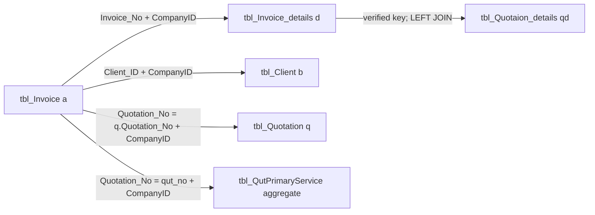

# Invoice Insert Data Lineage

## 1. When / Why / What

| | |
|---|---|
| **When** | Before any further Excel export enrichment. Invoice create (Auto + Manual) is the source of truth for what the export may treat as native invoice data versus quotation-side lookup. |
| **Why** | Search Invoice and View Invoice already export line-item workbooks from `tbl_Invoice` + `tbl_Invoice_details`. Proposed extra columns (`ItemNo`, `MaterialNo`, `PackSize`, `ItemRemarks`, `DeliveryDate`, `Department`, and related quotation fields) must not be invented or joined speculatively. Column names `Product_id` / `Product_Code` are **inverted** between quotation and invoice. `Quotation_No` on an invoice is not always a quotation number. |
| **What** | Read-only trace of every `INSERT` issued by `Add_invoice.aspx.cs` (`Button1_Click`) and `Manual_Invoice.aspx.cs` (`btnSave_Click`). Maps each inserted column to its source (UI, quotation/source document, product master, session, `CompanyContext`). Classifies future export fields as DIRECT / JOIN / AGGREGATE / DO NOT EXPORT. Verifies join keys from INSERT plus the consume SQL that already matches invoice lines to quotation lines. |

**Scope (read-only).** Target code:

- `Bill_Software/corporate/business/app/Add_invoice.aspx.cs`
- `Bill_Software/corporate/business/app/Manual_Invoice.aspx.cs`
- `Bill_Software/corporate/business/app/seartch_invoice.aspx.cs` (export consumer; no INSERT)
- `Bill_Software/corporate/business/app/View_Invoice.aspx.cs` (export consumer; no INSERT)
- `Bill_Software/corporate/business/app/InvoiceListHelper.cs` (XLSX writer; no INSERT)

Supporting evidence (not modified): `Create_quotation.aspx.cs` (quotation line identity), `InvoiceMail.aspx.cs` (`mailDate` UPDATE after create). Join-key evidence is the consume SQL inside `Add_invoice.aspx.cs` (`GetItemQueryByDocType`, `ReconcilePendingQuantities`, `LoadPriorInvoiceLines`).

**Not in this document:** schema changes, Grid/UI changes, or invoice INSERT changes. Search/View Excel export Layer 4 (quotation-detail LEFT JOIN) is recorded in section 8 as implemented.

---

## 2. Add Invoice Insert Flow

**Entry:** `Add_invoice.aspx.cs` → `Button1_Click`.

**Source document** (`ViewState["SelectedDocNo"]` as `refNo`, or `"N/A"`).

The picker grid binds `CommandArgument` to `DocNo`. Search SQL in `btnSertch_Click` sets `DocNo` as follows:

| `ddlDocType` | `DocNo` column (stored on invoice as `Quotation_No` / line `Quotation_no`) |
|---|---|
| Quotation | `tbl_Quotation.Quotation_no` (`RecordType = 'Quotation'`) |
| Purchase Order | `tbl_Quotation.Quotation_no` (`RecordType = 'Purchase Order'`). **Not** `PO_Number`. PO/DO appear only as grid `ExtRef`. |
| Proforma | `tbl_Proforma.Invoice_No` |
| Delivery Challan | `tbl_Chalan.Chalan_No` |

Grid rows are loaded by `GetItemQueryByDocType` into `ViewState["InvoiceItems"]`. **Loaded into that table but never inserted** on Auto invoice details: `MaterialNo`, `PackSize`, `Unit`, `DeliveryDate`, `Department`, `ItemRemarks`.

```mermaid
flowchart TD
    A[Button1_Click] --> B[Generate INV/C/{fy}/{slNo}<br/>MAX Sl_no WHERE CompanyID]
    B --> C[INSERT tbl_Invoice<br/>CompanyID written]
    C --> D[For each grid row]
    D --> E[INSERT tbl_Invoice_details<br/>CompanyID + ItemNo written]
    E --> F{Challan?}
    F -->|No| G[UPDATE tbl_NewProduct stock]
    F -->|Yes| H[Skip stock]
    G --> I[INSERT tbl_InvSiteAddress<br/>billing + shipping selected]
    H --> I
    I --> J[INSERT tbl_SystemNotification]
```

### 2.1 `tbl_Invoice` — every inserted column

Evidence: `Add_invoice.aspx.cs` `Button1_Click`, header INSERT at line 1093.

| Inserted column | Parameter / literal | Source value | Sourced from | CompanyID written? |
|---|---|---|---|---|
| `Invoice_No` | `@Inv` | `INV/C/{fy}/{slNo}` (`fy` from `txtinvoiceDate`; `slNo` = `MAX(Sl_no)+1` for current `CompanyID`) | Generated (not UI typed) | N/A (header key) |
| `Invoice_Date` | `@Date` | `txtinvoiceDate.Text` (raw string; FY for invoice number uses `DateTime.Parse` of the same box) | UI | — |
| `Quotation_No` | `@PO` | `ViewState["SelectedDocNo"]` (`DocNo` from picker) or `"N/A"` | Source document picker, not a free invoice field | — |
| `Client_ID` | `@CID` | `lblclientId.Text` after `SELECT Client_Id FROM tbl_Client WHERE Client_Name=@CName AND CompanyID=@CompanyID` | UI name → Client master (`CompanyID` scoped) | — |
| `Gross` | `@Gr` | `gGross` (sum of qty × rate across grid) | Computed from UI grid | — |
| `discount` | `@Di` | `gDisc` (sum of line discount amounts) | Computed from UI grid | — |
| `sub_total` | `@Sub` | `Math.Round(gGross - gDisc, 2)` | Computed | — |
| `Service_Tax1` | `@Tax` | `gTax` (sum of line GST amounts) | Computed from UI grid | — |
| `Net_Amount` | `@Net` | `gNet + freight + other` | Computed + UI freight/other | — |
| `Sl_no` | `@Sl` | Same serial used in invoice number | Generated, `WHERE CompanyID=@CompanyID` | — |
| `Delivery_Amount` | `@Frt` | `txt_delivery_amnt.Text` (0 if blank) | UI | — |
| `otherAmount1_name` | `@OthName` | `TextBox1.Text` | UI | — |
| `otherAmount1` | `@Oth` | `txt_othr_amnt.Text` (0 if blank) | UI | — |
| `status1` | `'No'` | Literal | Literal | — |
| `status2` | `'Active'` | Literal | Literal | — |
| `cgstOrsgst` | `@Intra` | `"YES"` if `RadioButtonGst.SelectedIndex == 0`, else `DBNull` | UI | — |
| `igst` | `@Inter` | `"YES"` if `RadioButtonGst.SelectedIndex == 1`, else `DBNull` | UI | — |
| `AddedById` | `@User` | `Session["USERID"]` or `"System"` | Session | — |
| `CompanyID` | `@CompanyID` | `CompanyContext.CurrentCompanyID` | CompanyContext | **Yes** |
| `SalesPersonCode` | `@SalesPerson` | `cmbSalesPerson.SelectedValue` | UI | — |
| `ExtInvoiceNo` | `@ExtNo` | `txtExtInvoiceNo.Text.Trim()`, or `DBNull` if blank | UI | — |
| `ExtInvoiceDate` | `@ExtDate` | `txtExtInvoiceDate.Text.Trim()`. Save is blocked if empty (`Button1_Click` guard). Parameter still falls back to `DBNull` if whitespace. | UI | — |
| `BillingAddress` | `@BillingAddress` | `List_BillingAddress.SelectedItem.Text` or `"N/A"` | UI | — |

**Not in this INSERT** (do not treat as created here): `Quotation_Date`, `mailDate`, `TimeStamp`, `addressfor`, `Service_Tax` (print alias), `status3`/`status4`/`mailStatus`/`CheckStatus`, payment/dispatch columns.

`mailDate` is written later by `InvoiceMail.aspx.cs` (`UPDATE tbl_Invoice SET mailDate=@mailDate ...`). `TimeStamp` is selected by export but is not in this INSERT list (persistence mechanism is outside these two create pages).

### 2.2 `tbl_Invoice_details` — every inserted column

Evidence: per-row INSERT in `Button1_Click` (`Add_invoice.aspx.cs` line 1150).

| Inserted column | Parameter | Source value | Sourced from | CompanyID written? |
|---|---|---|---|---|
| `Invoice_No` | `@Inv` | Same generated header number | Generated | — |
| `Quotation_no` | `@RefNo` | Same `refNo` as header `Quotation_No` | Source document | — |
| `Product_id` | `@PID` | Memory row `TrueID` (`ViewState["InvoiceItems"]`) | Source document line (see identity map below) | — |
| `Product_Code` | `@HSN` | Memory row `TrueHSN` | Source document line | — |
| `Product_name` | `@Name` | `HttpUtility.HtmlDecode` of memory row `Product_name` | Source document line (user may edit name in grid) | — |
| `Quantity` | `@Qty` | `txtqnty` | UI (pre-filled from pending qty) | — |
| `sail_rate` | `@Rate` | `txtsailrate` | UI (pre-filled from source) | — |
| `discountRate` | `@DPer` | `txtDiscPer` | UI | — |
| `Service_tax_rate` | `@TPer` | `lblGstRate` | UI / product GST | — |
| `Total_sail_rate1` | `@Net` | Line net (taxable + GST) | Computed | — |
| `Total_sail_rate2` | `@Base` | Taxable value (`qty×rate − txtDiscAmt`) | Computed from UI | — |
| `specification` | `@Brand` | `txtdes` | UI (pre-filled `specification`) | — |
| `ItemNo` | `@ItemNo` | `InvoiceItems` memory row `ItemNo` (`""` if DBNull). Table lives in `ViewState["InvoiceItems"]`. | Source document line | — |
| `AddedById` | `@User` | Session `USERID` or `"System"` | Session | — |
| `CompanyID` | `@CompanyID` | `CompanyContext.CurrentCompanyID` | CompanyContext | **Yes** |

**Loaded into the item DataTable and not inserted:** `MaterialNo`, `PackSize`, `Unit`, `DeliveryDate`, `Department`, `ItemRemarks`.

- Quotation / Purchase Order: all six come from `tbl_Quotaion_details`.
- Proforma: SELECT forces `''` for ItemNo and those six extras.
- Challan: `ItemNo`, `MaterialNo`, `PackSize` from `tbl_Challan_details`; `Unit`, `DeliveryDate`, `Department`, `ItemRemarks` forced `''`. Challan load joins quotation details on `qd.Product_Code = cd.Product_id` **without** ItemNo (load-only; not an export key).

### 2.3 Auto line identity by source document

Quotation create (`Create_quotation.aspx.cs`) inserts cart as:

- `tbl_Quotaion_details.Product_id` ← cart `Product_code` (**HSN**)
- `tbl_Quotaion_details.Product_Code` ← cart `ProductId` (**true product id**)

Auto invoice load for Quotation/PO (`GetItemQueryByDocType`):

- `qd.Product_Code AS TrueID`
- `qd.Product_id AS TrueHSN`

Auto invoice INSERT then stores:

- `tbl_Invoice_details.Product_id` = TrueID = quotation **`Product_Code`** (true product id)
- `tbl_Invoice_details.Product_Code` = TrueHSN = quotation **`Product_id`** (HSN)

| Source radio | TrueID (`invoice.Product_id`) | TrueHSN (`invoice.Product_Code`) | ItemNo inserted |
|---|---|---|---|
| Quotation | `tbl_Quotaion_details.Product_Code` | `tbl_Quotaion_details.Product_id` | `qd.ItemNo` |
| Purchase Order | same quotation-detail columns (PO rows are quotation lines) | same | `qd.ItemNo` |
| Proforma | `tbl_Proforma_details.Product_id` (SELECT aliases `pd.Product_id AS TrueID`; table name in SQL is `tbl_Proforma_Details`) | `pd.Product_Code` | forced `''` |
| Challan | `tbl_Challan_details.Product_id` | `cd.Product_code` | `cd.ItemNo` |

### 2.4 Other Auto INSERTs (not invoice header/detail, listed for completeness)

**`tbl_InvSiteAddress`** (once per selected billing item, once per selected shipping item):

| Column | Source |
|---|---|
| `invoice_no` | Generated invoice number |
| `SiteAddress` | `List_BillingAddress` / `List_ShippingAddress` selected `Text` |
| `CompanyID` | CompanyContext — **written** |

**`tbl_SystemNotification`:** `Title`, `Message`, `ModuleCode`, `Severity`, `StartDate`, `EndDate`, `IsActive`, `CreatedBy` (`USERID`), `CompanyID` — **written**.

**Not INSERT:** `UPDATE tbl_NewProduct SET Quantity = Quantity - @Qty WHERE ProductID=@PID AND CompanyID=@CompanyID` skipped when source is Challan.

---

## 3. Manual Invoice Insert Flow

**Entry:** `Manual_Invoice.aspx.cs` → `btnSave_Click`.

Products come from `tbl_NewProduct` via `rptProduct` (no quotation/PO/proforma/challan loader). `txtPONo` is a free-text PO field stored into `tbl_Invoice.Quotation_No`.

```mermaid
flowchart TD
    A[btnSave_Click] --> B[GenerateInvoiceNo<br/>INV/C/{fy}/{slNo} CompanyID-scoped]
    B --> C[INSERT tbl_Invoice<br/>CompanyID written<br/>no ExtInvoiceDate<br/>no BillingAddress]
    C --> D[For each rptProduct row]
    D --> E[INSERT tbl_Invoice_details<br/>CompanyID written<br/>ItemNo NOT in INSERT]
    E --> F[UPDATE tbl_NewProduct stock<br/>always]
    F --> G[INSERT tbl_InvSiteAddress<br/>selected lstAddresses]
    G --> H[INSERT tbl_SystemNotification<br/>different column set than Auto]
```

### 3.1 `tbl_Invoice` — every inserted column

Evidence: `Manual_Invoice.aspx.cs` `btnSave_Click`, header INSERT at line 403.

| Inserted column | Parameter / literal | Source value | Sourced from | CompanyID written? |
|---|---|---|---|---|
| `Invoice_No` | `@Inv` | `GenerateInvoiceNo()` → `INV/C/{fy}/{slNo}` | Generated | N/A |
| `Invoice_Date` | `@Date` | `txtInvoiceDate.Text` (raw; not parsed for INSERT) | UI | — |
| `Quotation_No` | `@PO` | `txtPONo.Text.Trim()` or `"N/A"` | UI (typed PO; **not** loaded from `tbl_Quotation`) | — |
| `Client_ID` | `@CID` | `lblClientID.Text` after `tbl_Client` lookup `Client_Name` + `CompanyID` | UI → Client master | — |
| `Gross` | `@Gr` | `gGross` | Computed from product repeater | — |
| `discount` | `@Di` | `gDisc` | Computed | — |
| `sub_total` | `@Sub` | `Round(gGross - gDisc, 2)` | Computed | — |
| `Service_Tax1` | `@Tax` | `gTax` | Computed | — |
| `Net_Amount` | `@Net` | `gNet + freight + other` | Computed + UI | — |
| `Sl_no` | `@Sl` | Serial from `GenerateInvoiceNo` | Generated, CompanyID-scoped | — |
| `Delivery_Amount` | `@Frt` | `txtFreight.Text` (0 if blank) | UI | — |
| `otherAmount1_name` | `@OthName` | C# literal `"Other Charges"` | Literal (not a UI name box) | — |
| `otherAmount1` | `@Oth` | `txtOtherCharge.Text` (0 if blank) | UI | — |
| `status1` | `'No'` | Literal | Literal | — |
| `status2` | `'Active'` | Literal | Literal | — |
| `cgstOrsgst` | `@Intra` | `"YES"` if `rbTaxType.SelectedValue == "1"`, else `null` | UI | — |
| `igst` | `@Inter` | `"YES"` if `rbTaxType.SelectedValue == "0"`, else `null` | UI | — |
| `AddedById` | `@User` | Session `USERID` or `"System"` | Session | — |
| `CompanyID` | `@CompanyID` | CompanyContext | CompanyContext | **Yes** |
| `SalesPersonCode` | `@SalesPerson` | `cmbSalesPerson.SelectedValue` if index ≠ 0, else `""` | UI | — |
| `ExtInvoiceNo` | `@ERP` | `txtERPRef.Text.Trim()` | UI | — |

**Not in Manual header INSERT:** `ExtInvoiceDate`, `BillingAddress`.

### 3.2 `tbl_Invoice_details` — every inserted column

Evidence: per-row INSERT in `btnSave_Click` (`Manual_Invoice.aspx.cs` line 452).

| Inserted column | Parameter | Source value | Sourced from | CompanyID written? |
|---|---|---|---|---|
| `Invoice_No` | `@Inv` | Generated header number | Generated | — |
| `Quotation_no` | `@PO` | Same `strPo` as header (`txtPONo` or `"N/A"`) | UI | — |
| `Product_id` | `@PID` | Cart `ProductID` | Product master (`tbl_NewProduct.ProductID` — true id). Comment in code: `@PID = TrueID`. | — |
| `Product_Code` | `@HSN` | Cart `Product_code` | Product master HSN. Comment in code: `@HSN = HSN Code`. | — |
| `Product_name` | `@Name` | Cart `ProductName` | Product master / cart (no HtmlDecode on this INSERT) | — |
| `Quantity` | `@Qty` | Cart `IQuantity` | UI / cart | — |
| `sail_rate` | `@Rate` | Cart `Sail_Rate` | UI / cart | — |
| `discountRate` | `@DPer` | Cart `Discount_Rate` | UI / cart | — |
| `Service_tax_rate` | `@TPer` | Cart `Tax_Rate` | UI / cart | — |
| `Total_sail_rate1` | `@Net` | Line net | Computed | — |
| `Total_sail_rate2` | `@Base` | Taxable (`qty×rate` minus percent discount amount) | Computed from cart (not a UI discount-amount box) | — |
| `specification` | `@Brand` | Cart `Brand` | UI / cart | — |
| `AddedById` | `@User` | Session | Session | — |
| `CompanyID` | `@CompanyID` | CompanyContext | CompanyContext | **Yes** |

**`ItemNo` is not in the Manual INSERT list.** Manual lines therefore have no evidenced ItemNo write at create.

### 3.3 Other Manual INSERTs

**`tbl_InvSiteAddress`:** `invoice_no`, `SiteAddress` (`lstAddresses` selected `Text`), `CompanyID` — **written**.

**`tbl_SystemNotification`:** `Title`, `Message`, `Module`, `Type`, `UserID`, `CreatedDate`, `IsRead`, `CompanyID` — **written**. Column set **differs** from Auto (`Module`/`Type`/`UserID` vs `ModuleCode`/`Severity`/`CreatedBy`/`StartDate`/`EndDate`/`IsActive`).

**Stock:** always `UPDATE tbl_NewProduct ... ProductID=@PID AND CompanyID=@CompanyID` (no challan skip).

---

## 4. Auto vs Manual Comparison

Classification is **per invoice-table column that either flow inserts**, plus create-time behaviour that affects export.

| Field / behaviour | Classification | Evidence |
|---|---|---|
| `Invoice_No` pattern `INV/C/{fy}/{slNo}` | Same | Both generate; both scope `MAX(Sl_no)` with `CompanyID` |
| `Invoice_Date` | Same | Both UI date textboxes |
| `Quotation_No` | Different source | Auto: picker `DocNo` = quotation number for Quotation **and** Purchase Order; Proforma `Invoice_No`; Challan `Chalan_No`; or `"N/A"`. Manual: typed `txtPONo` / `"N/A"` |
| `Client_ID` | Same | Both `tbl_Client` by name + `CompanyID` |
| `Gross`, `discount`, `sub_total`, `Service_Tax1`, `Net_Amount` | Same | Both computed from line qty/rate/discount/GST + freight + other |
| `Sl_no` | Same | CompanyID-scoped serial |
| `Delivery_Amount` | Same | UI freight |
| `otherAmount1` | Same | UI other amount |
| `otherAmount1_name` | Different source | Auto: `TextBox1`. Manual: literal `'Other Charges'` |
| `status1` `'No'`, `status2` `'Active'` | Same | Literals |
| `cgstOrsgst` / `igst` | Same | UI tax radio; Auto uses `SelectedIndex`, Manual uses `SelectedValue` `"1"`/`"0"` |
| `AddedById` | Same | Session `USERID` / `"System"` |
| `CompanyID` | Same | CompanyContext **written on header and every detail row** |
| `SalesPersonCode` | Same | Combo; Manual blanks when index 0 |
| `ExtInvoiceNo` | Same | Auto `txtExtInvoiceNo`; Manual `txtERPRef` |
| `ExtInvoiceDate` | Auto only | Manual INSERT omits column |
| `BillingAddress` | Auto only | Manual INSERT omits column |
| Detail `Invoice_No` | Same | Header number |
| Detail `Quotation_no` | Different source | Same semantic split as header `Quotation_No` |
| Detail `Product_id` | Different source | Auto: source-doc TrueID (quotation `Product_Code` when QTN/PO). Manual: `tbl_NewProduct.ProductID` |
| Detail `Product_Code` | Different source | Auto: TrueHSN (quotation `Product_id` when QTN/PO). Manual: product `Product_code` HSN |
| Detail `Product_name`, `Quantity`, `sail_rate`, `discountRate`, `Service_tax_rate`, `Total_sail_rate1`, `Total_sail_rate2`, `specification` | Same | Grid/repeater UI + compute |
| Detail `ItemNo` | Auto only | Present in Auto INSERT; absent from Manual INSERT |
| Detail `AddedById`, `CompanyID` | Same | Session / CompanyContext |
| `MaterialNo`, `PackSize`, `ItemRemarks`, `DeliveryDate`, `Department` | Neither inserts | Auto loads them into ViewState only; Manual never loads them |
| Stock deduct | Different source | Auto skips Challan; Manual always deducts |
| `tbl_InvSiteAddress` | Same | Selected address text + CompanyID |
| `tbl_SystemNotification` | Different source | Different column schemas |

---

## 5. Complete Data Lineage Matrix

Legend:

- **Invoice Header** = `tbl_Invoice` at create
- **Invoice Detail** = `tbl_Invoice_details` at create
- **Quotation Header** = `tbl_Quotation` (not written by invoice create)
- **Quotation Detail** = `tbl_Quotaion_details` (spelling in schema; not written by invoice create)
- **Stored** = column is in that table’s create INSERT (or is the table’s natural key already persisted)
- **Not inserted** = invoice create does not write it
- **N/A** = field does not live on that table in the create path

| Excel Field | Invoice Header | Invoice Detail | Quotation Header | Quotation Detail | Source of Truth | Export Strategy |
|---|---|---|---|---|---|---|
| Invoice Number | `Invoice_No` Stored | `Invoice_No` Stored (FK) | N/A | N/A | `tbl_Invoice.Invoice_No` | DIRECT |
| ERP Ref | `ExtInvoiceNo` Stored | N/A | N/A | N/A | `tbl_Invoice.ExtInvoiceNo` | DIRECT |
| Client Name | `Client_ID` Stored | N/A | `Client_Id` on quotation (not copied) | N/A | `tbl_Client.Client_Name` via `Client_ID` + `CompanyID` | JOIN (client master; already in export) |
| Source Reference | `Quotation_No` Stored | `Quotation_no` Stored | Matches when Auto `DocNo` is `tbl_Quotation.Quotation_no` (Quotation **or** Purchase Order) | Line `Quotation_no` | `tbl_Invoice.Quotation_No` (semantic mix: quotation number / proforma invoice number / challan number / typed Manual PO / `N/A`) | DIRECT (do not assume every value is a quotation key) |
| PO Number | Not inserted | Not inserted | `PO_Number` | N/A | `tbl_Quotation.PO_Number` | JOIN quotation header when `a.Quotation_No = q.Quotation_No` **and** `q.CompanyID = @CompanyID`. Auto Quotation **and** Auto Purchase Order both store `Quotation_no` as `DocNo`, so this join is INSERT-aligned for those two Auto types. It does not bind Manual typed PO, Proforma `Invoice_No`, or Challan `Chalan_No`. Current export already uses this LEFT JOIN. |
| DO Number | Not inserted | Not inserted | `DO_Number` | N/A | `tbl_Quotation.DO_Number` | JOIN same as PO Number |
| Primary Service | Not inserted | Not inserted | N/A (child table) | N/A | `tbl_QutPrimaryService.PrimaryService` grouped by `qut_no` | AGGREGATE (already in export; `CompanyID` on service rows) |
| ItemNo | N/A | Stored **Auto only** | N/A | `ItemNo` on quotation/PO lines | Auto: `tbl_Invoice_details.ItemNo`. Manual: not written. Quotation: `tbl_Quotaion_details.ItemNo` | DIRECT from invoice details for Auto. Do not join to copy ItemNo. Manual: no create-time value. |
| MaterialNo | N/A | **Not inserted** (ViewState only on Auto) | N/A | `MaterialNo` | `tbl_Quotaion_details.MaterialNo` | JOIN quotation detail with verified key (Auto QTN/PO only). DO NOT EXPORT for Manual / Proforma / Challan / typed-PO without a separate evidenced mapping. |
| PackSize | N/A | **Not inserted** | N/A | `PackSize` | `tbl_Quotaion_details.PackSize` | JOIN same as MaterialNo |
| ItemRemarks | N/A | **Not inserted** | N/A | `ItemRemarks` | `tbl_Quotaion_details.ItemRemarks` | JOIN same as MaterialNo |
| DeliveryDate | N/A | **Not inserted** | N/A | `DeliveryDate` | `tbl_Quotaion_details.DeliveryDate` | JOIN same as MaterialNo |
| Department | N/A | **Not inserted** | N/A | `Department` | `tbl_Quotaion_details.Department` | JOIN same as MaterialNo |
| Product_id | N/A | Stored | N/A | Stored **inverted** (`Product_id` = HSN on quotation insert) | Invoice: true product id. Quotation: HSN in `Product_id` | DIRECT invoice `d.Product_id` (already “Item Code”). Never equate invoice `Product_id` to quotation `Product_id`. |
| Product_Code | N/A | Stored | N/A | Stored **inverted** (`Product_Code` = true id on quotation insert) | Invoice: HSN. Quotation: true id in `Product_Code` | DIRECT invoice `d.Product_Code` (already “HSN Code”) |
| Product_name | N/A | Stored | N/A | `Product_name` | Invoice line name at save (may differ from quotation after edit) | DIRECT `d.Product_name` |
| Quantity | N/A | Stored | N/A | `Quantity` (source pending qty, not copied as invoice qty) | Invoiced qty is `tbl_Invoice_details.Quantity` | DIRECT |
| Rate | N/A | `sail_rate` Stored | N/A | `sail_rate` | Invoice `d.sail_rate` | DIRECT |
| DiscountRate | N/A | `discountRate` Stored | N/A | quotation has `discountRate` (not copied as-is beyond grid) | Invoice `d.discountRate` | DIRECT |
| Taxable Value | N/A | `Total_sail_rate2` Stored | N/A | N/A | Invoice `d.Total_sail_rate2` | DIRECT |
| GST % | N/A | `Service_tax_rate` Stored | N/A | N/A | Invoice `d.Service_tax_rate` | DIRECT |
| Item Net Value | N/A | `Total_sail_rate1` Stored | N/A | N/A | Invoice `d.Total_sail_rate1` | DIRECT |
| Service_Tax1 | Stored | N/A | N/A | N/A | Header GST amount stored at create | DIRECT (do not recompute) |
| Net_Amount | Stored | N/A | N/A | N/A | Header grand total | DIRECT |
| Delivery_Amount | Stored | N/A | N/A | N/A | Header freight | DIRECT |
| otherAmount1 | Stored | N/A | N/A | N/A | Header other charges | DIRECT |
| Quotation_Date | **Not inserted** by Auto or Manual | N/A | `Quotation_Date` on `tbl_Quotation` | N/A | Not written at invoice INSERT. Export currently selects `a.Quotation_Date`. Persistence is **not** evidenced in these two INSERT lists. | Do not treat as create-time DIRECT. Prefer JOIN `tbl_Quotation.Quotation_Date` when the invoice `Quotation_No` is actually a quotation number; otherwise leave as today (column may be null). |
| MailDate | **Not inserted** at create | N/A | N/A | N/A | `InvoiceMail.aspx.cs` UPDATE `mailDate` | DIRECT on header **after mail**, not at create |
| AddedById | Stored | Stored | N/A | N/A | Session at create | DIRECT (export already resolves login name) |

---

## 6. Join Safety Analysis

### 6.1 Keys actually inserted on invoice details

| Invoice detail column | Auto INSERT | Manual INSERT |
|---|---|---|
| `Invoice_No` | Yes | Yes |
| `Quotation_no` | Yes = picker `DocNo` (quotation number for QTN and PO; proforma invoice number; challan number; or `N/A`) | Yes = typed PO / N/A |
| `Product_id` | Yes = TrueID | Yes = NewProduct ProductID |
| `Product_Code` | Yes = TrueHSN | Yes = NewProduct Product_code |
| `ItemNo` | Yes (may be `''`) | **Not inserted** |
| `CompanyID` | Yes | Yes |

### 6.2 Keys on quotation details (create, not invoice)

`Create_quotation.aspx.cs` INSERT into `tbl_Quotaion_details` includes `Quotation_no`, `Product_id` (HSN), `Product_Code` (true id), `ItemNo`, `MaterialNo`, `PackSize`, `ItemRemarks`, `DeliveryDate`, `Department`, `CompanyID`, plus amounts.

### 6.3 Evidence already used in this codebase to match invoice lines to quotation lines

**Consume / pending qty** (`Add_invoice.aspx.cs` `GetItemQueryByDocType` for Quotation and PO):

```text
id.Quotation_no = qd.Quotation_no
AND id.Product_id = qd.Product_Code
AND ISNULL(id.ItemNo,'') = ISNULL(qd.ItemNo,'')
AND id.CompanyID = @CompanyID
AND iv.status2 = 'Active'
```

**C# reconcile** (`ReconcilePendingQuantities`): Pass 1 matches **ItemNo**; Pass 2 legacy blank ItemNo uses `ProductsMatch(TrueID, TrueHSN, invoice.Product_id, invoice.Product_Code)`.

**Prior invoice load** (`LoadPriorInvoiceLines`): prior lines are those whose `d.Quotation_no` **or** `h.Quotation_No` equals the current picker `DocNo`, scoped by `h.CompanyID`, excluding blocked/cancelled headers.

**Challan load of quotation lines** (weaker, load-only, `GetItemQueryByDocType` default branch): `ch.Quotation_No = qd.Quotation_no AND qd.Product_Code = cd.Product_id AND qd.CompanyID = @CompanyID` **without** ItemNo. That is not sufficient for export uniqueness.

**Not cited:** no `Print_Purchase_Order.aspx.cs` / `Print_Challan.aspx.cs` files exist in this repository. Join recommendations below use only INSERT + consume SQL in `Add_invoice.aspx.cs`.

### 6.4 Candidate join keys — verdict

| Candidate | Safe? | Why |
|---|---|---|
| `Quotation_no` only | **No** | Multiple lines per quotation. Fan-out. |
| `Quotation_no` + invoice `Product_id` = quotation `Product_id` | **No** | Column names are inverted. Invoice `Product_id` is quotation `Product_Code`. Equating both `Product_id` columns is a wrong join. |
| `Quotation_no` + invoice `Product_id` = quotation `Product_Code` without ItemNo | **Unsafe** | Same product can repeat on a quotation; consume SQL includes ItemNo for that reason. |
| `Quotation_no` + `ItemNo` without product | **Unsafe** | ItemNo can be blank (`''` / NULL). Two blank ItemNo lines would collide. |
| `Quotation_no` + invoice `Product_id` = quotation `Product_Code` + `ISNULL(ItemNo,'')` + `CompanyID` | **Yes, for Auto invoices whose stored `Quotation_no` is `tbl_Quotaion_details.Quotation_no`** | This is the consume SQL key. Auto Quotation **and** Auto Purchase Order both persist picker `DocNo` = `t.Quotation_no`. |
| Same key for Manual invoices | **No** | Manual `Quotation_no` is typed PO / N/A; Manual does not insert ItemNo; no evidence Manual lines were copied from quotation details. |
| Same key for Auto Purchase Order | **Yes** | Picker `DocNo` is `tbl_Quotation.Quotation_no` (`SELECT t.Quotation_no AS DocNo` for both Quotation and Purchase Order). INSERT writes that value, not `PO_Number`. |
| Same key for Proforma / Challan | **No** | Proforma INSERT stores `tbl_Proforma.Invoice_No` and forces ItemNo `''`; TrueID is proforma `Product_id`. Challan INSERT stores `tbl_Chalan.Chalan_No`. Neither equals `qd.Quotation_no` by INSERT evidence. |

### 6.5 Verified join key recommendation

**Do not join quotation details on `Quotation_no` only.**

**Do not join `d.Product_id = qd.Product_id`.**

**Verified key (Auto + source document is a Quotation number that exists on `tbl_Quotaion_details.Quotation_no`):**

```text
qd.Quotation_no = d.Quotation_no
AND qd.Product_Code = d.Product_id
AND ISNULL(qd.ItemNo,'') = ISNULL(d.ItemNo,'')
AND qd.CompanyID = @CompanyID
```

Optional filters: Auto `GetItemQueryByDocType` for Quotation/PO does **not** apply `IsLatest` or `IsDeleted`. Do not add those filters in export without separate evidence; they are not part of the INSERT or consume SQL in `Add_invoice.aspx.cs`.

**Auto Purchase Order:** same verified key. `DocNo` is `t.Quotation_no`, and INSERT writes that value into `tbl_Invoice.Quotation_No` / `tbl_Invoice_details.Quotation_no`.

**Manual / Proforma / Challan / `N/A`:** do not join quotation details.

---

## 7. Export Classification

Current Search/View export already implements DIRECT header/detail amounts, client name, source reference, quotation-header PO/DO (when `a.Quotation_No` matches `q.Quotation_No`), and AGGREGATE Primary Service. Classifications below are for **future** enrichment of the remaining candidates.

| Field | Class | Notes |
|---|---|---|
| Invoice Number | DIRECT | `a.Invoice_No` |
| ERP Ref | DIRECT | `a.ExtInvoiceNo` |
| Client Name | JOIN | `tbl_Client` + `CompanyID` (already) |
| Source Reference | DIRECT | `a.Quotation_No` — mixed semantics |
| PO Number | JOIN | `tbl_Quotation.PO_Number` + `CompanyID` when `a.Quotation_No` equals `q.Quotation_No` (Auto Quotation and Auto Purchase Order) |
| DO Number | JOIN | `tbl_Quotation.DO_Number` + `CompanyID` (same header join) |
| Primary Service | AGGREGATE | `tbl_QutPrimaryService.PrimaryService` by `qut_no` + `CompanyID` (already). Do not use grid `tbl_QuoPriSerTogather.PServiceName` |
| ItemNo | DIRECT | `d.ItemNo` for Auto. Manual: column unused at INSERT — exporting it yields DB default/NULL, not a quotation ItemNo |
| MaterialNo | JOIN | Quotation detail via **verified key** only; else DO NOT EXPORT |
| PackSize | JOIN | Same as MaterialNo |
| ItemRemarks | JOIN | Same as MaterialNo |
| DeliveryDate | JOIN | Same as MaterialNo |
| Department | JOIN | Same as MaterialNo |
| Product_id | DIRECT | Invoice `d.Product_id` (Item Code). DO NOT EXPORT quotation `Product_id` (HSN) under this name |
| Product_Code | DIRECT | Invoice `d.Product_Code` (HSN) |
| Product_name | DIRECT | `d.Product_name` |
| Quantity | DIRECT | `d.Quantity` |
| Rate | DIRECT | `d.sail_rate` |
| DiscountRate | DIRECT | `d.discountRate` |
| Taxable Value | DIRECT | `d.Total_sail_rate2` |
| GST % | DIRECT | `d.Service_tax_rate` |
| Item Net Value | DIRECT | `d.Total_sail_rate1` |
| Service_Tax1 | DIRECT | `a.Service_Tax1` stored |
| Net_Amount | DIRECT | `a.Net_Amount` |
| Delivery_Amount | DIRECT | `a.Delivery_Amount` |
| otherAmount1 | DIRECT | `a.otherAmount1` |
| Quotation_Date | DO NOT EXPORT as create DIRECT | Not in Auto/Manual INSERT. Current export column is opportunistic on `a.Quotation_Date`. Safer future: JOIN quotation header date when keys match |
| MailDate | DIRECT after mail | Not create INSERT; UPDATE in `InvoiceMail.aspx.cs` |
| AddedById | DIRECT | `a.AddedById` |
| CompanyID | DO NOT EXPORT | Tenant filter only; never a workbook column |
| `status1` / `status2` | DO NOT EXPORT | Create literals; not requested as Excel business columns |
| Client master address / GSTIN | DO NOT EXPORT | Duplicates; deferred in inventory |
| BillingAddress / ExtInvoiceDate | DO NOT EXPORT until required | Auto-only INSERT; Manual omits |

**Special attention (ItemNo, MaterialNo, PackSize, ItemRemarks, DeliveryDate, Department):**

| Field | On invoice at INSERT? | Safe next step |
|---|---|---|
| ItemNo | Auto yes, Manual no | Export `d.ItemNo` as DIRECT. Do not join quotation just to populate ItemNo. |
| MaterialNo, PackSize, ItemRemarks, DeliveryDate, Department | **No** (loaded into `InvoiceItems`, not inserted) | JOIN quotation details with verified key **and** only for Auto rows whose `d.Quotation_no` is a `tbl_Quotaion_details.Quotation_no` (Quotation and Purchase Order pickers). Leave NULL for Manual, Proforma, Challan. Do not inner-join (would drop invoice lines). |

---

## 8. Recommended Final Export Architecture

Keep the current Search/View export grain: **one workbook row per `tbl_Invoice_details` line**, header columns repeated, `CompanyID` predicate on every table, no `CompanyID` column.



Solid arrows = implemented and INSERT-aligned.

**Layer 1 — DIRECT (no new joins):** invoice number, dates that exist on `a`/`d`, ERP ref, source reference, item code, HSN, name, qty, rate, discount %, taxable, GST %, line net, header GST, grand total, freight, other, created-by, ItemNo from `d`.

**Layer 2 — JOIN header (already shipped):** client name; PO Number; DO Number; quotation date only if taken from `q` when the join hits.

**Layer 3 — AGGREGATE (already shipped):** Primary Service from `tbl_QutPrimaryService`, one concatenated string per `qut_no`, `CompanyID` scoped, `GROUP BY qut_no` so lines do not multiply.

**Layer 4 — JOIN detail (shipped in Search/View export):** LEFT JOIN a 1-row-per-key derived table over `tbl_Quotaion_details` (schema spelling; not `tbl_Quotation_details`).

Verified identity (unchanged):

```text
qd.Quotation_no = d.Quotation_no
AND qd.Product_Code = d.Product_id
AND qd.ItemNo = ISNULL(d.ItemNo, '')
AND qd.CompanyID = @CompanyID
```

Version uniqueness (export derived table, not a raw table join):

- Edit/archive writes (`Edit_quatation_v2.aspx.cs`, `Edit_quatation.aspx.cs`, `edit_purchaseorder.aspx.cs`) set previous lines `IsDeleted = 1`, `IsLatest = 0` and insert live lines `IsDeleted = 0`, `IsLatest = 1`.
- Live readers (`PurchaseOrderPrintHelper.cs`, edit load) use `IsLatest = 1 AND IsDeleted = 0`.
- `Create_quotation.aspx.cs` INSERT does not populate `IsLatest` / `IsDeleted`, so export cannot use equality-only `IsLatest = 1` (would miss never-edited create rows).
- Derived table keeps `ISNULL(IsDeleted, 0) = 0`, then `ROW_NUMBER()` partitioned by `CompanyID, Quotation_no, Product_Code, ISNULL(ItemNo,'')`, ordered by print live-row first (`IsLatest = 1 AND IsDeleted = 0`), then `Version DESC`, then `Id DESC`. Filter `rn = 1`. LEFT JOIN only.

Export columns after Primary Service: Item No (`d.ItemNo` DIRECT), Material No, Pack Size, Delivery Date, Department, Item Remarks (`qd.*`). Manual / Proforma / Challan / `N/A` remain NULL when the key does not match. Grid BindData is unchanged.

**Not required:** a second join from invoice `Quotation_No` to `tbl_Quotation.PO_Number`. Auto Purchase Order invoices do not store `PO_Number` in `Quotation_No`.

---

## Validation

| Check | Result |
|---|---|
| Every INSERT column into `tbl_Invoice` from Auto documented | Yes (23 columns including `CompanyID`) |
| Every INSERT column into `tbl_Invoice` from Manual documented | Yes (21 columns including `CompanyID`; no `ExtInvoiceDate`, no `BillingAddress`) |
| Every INSERT column into `tbl_Invoice_details` from Auto documented | Yes (15 columns including `ItemNo` and `CompanyID`) |
| Every INSERT column into `tbl_Invoice_details` from Manual documented | Yes (14 columns; `ItemNo` absent) |
| `CompanyID` persistence | Written on Auto header, Auto details, Manual header, Manual details, both site-address inserts, both notification inserts |
| Join keys from code, not guessed | Consume SQL in `GetItemQueryByDocType` + INSERT identity map from `TrueID`/`TrueHSN` + picker `DocNo` SQL |
| Speculative joins | None recommended |
| Search/View export Layer 4 | Shipped: 1-row-per-key LEFT JOIN derived table on verified key + live-row order (`IsLatest`/`IsDeleted`/`Version`/`Id`); Grid BindData untouched |

**READY FOR FINANCE UAT** — Layer 4 columns are on Search/View Excel export only. Manual / Proforma / Challan quotation-detail cells stay NULL unless the verified key matches.
